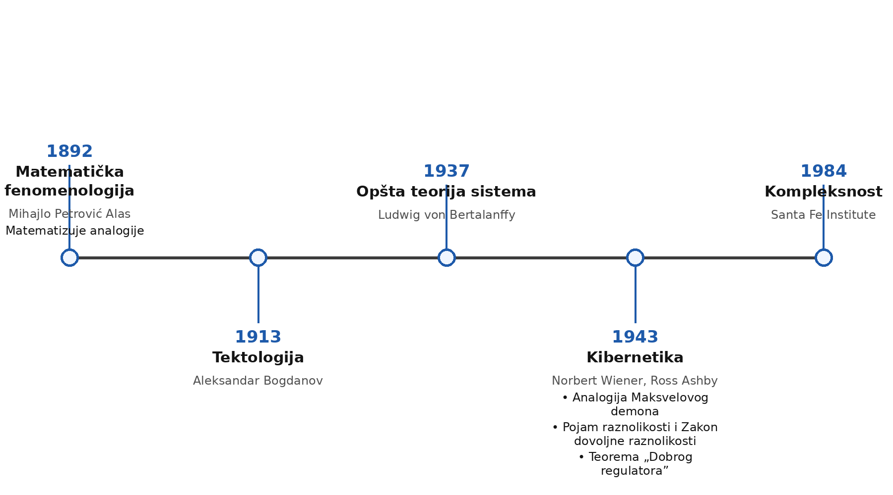
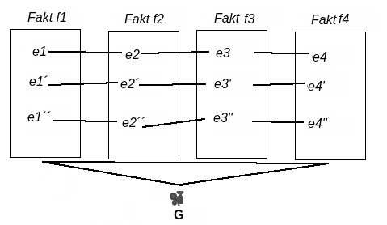
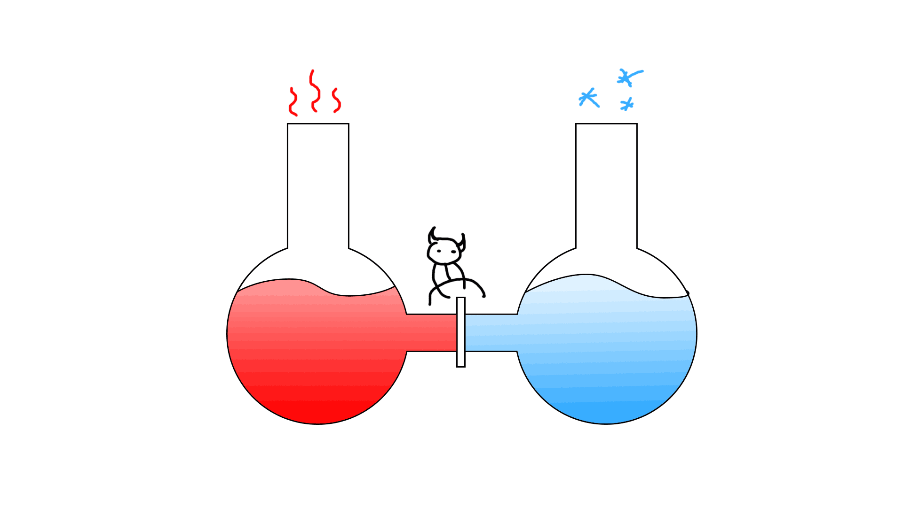

#+TITLE: Analogije, Kontrola i Slobodna volja
#+AUTHOR: Pavle Mačkić
#+REVEAL_ROOT: https://cdn.jsdelivr.net/npm/reveal.js
#+REVEAL_VERSION: 4
#+REVEAL_THEME: simple
#+OPTIONS: num:nil toc:nil
#+EXPORT_FILE_NAME: index
* Nauke interdisciplinarnosti
#+begin_quote
Biblioteka je groblje umova - Božidar Knežević, Misli, 335

#+end_quote

** Vremenska linija
#+ATTR_REVEAL: :width 900

* Matematika u proširenom smislu
#+ATTR_REVEAL: :width 600px

+ Analoške grupe
** Primeri Tipova elemenata:
1. Impulsivni
2. Depresivni/Regulativni
3. Impulsivni
* Maksvelov Demon
#+ATTR_REVEAL: :width 600px

** Probajte sami
https://pmackic.itch.io/maksvelov-demon
#+ATTR_REVEAL: :width 450px height 450px :center t

* Analoška grupa demona
1. Inženjering - klima
2. Biologija - život/evolucija
3. Društvene nauke - Država,Društveni pokret,Klika
4. Ekonomija - Firme
5. Dizajn/Umetnost
** Uloge
1. Demon - regulativna
   + Kognitivni kapacitet - impulsivna
   + Motivacije - prepreka, teren, rezonanca
   + Emocije - depresivna, koordinatorske
2. Posude - teren
3. N Atoma - korelativan lanac, haotični efekti
* Raznolikost
#+ATTR_REVEAL: :frag (appear)
*Sistem* - set varijabli izabranih za posmatranjem
#+ATTR_REVEAL: :frag (appear)
*Raznolikost* - Broj stanja koje sistem može da zauzme
#+ATTR_REVEAL: :frag (appear)
*Zakon Dovoljnih raznolikosti* - Samo raznolikosti apsorbuju raznolikosti
** Intuitivne pumpe
1. Knjige - strane,rečenice,slova,značenja....
2. Prekidači za svetlo
3. Robotski šahisti
4. Maksvelov demon
   - savršeni ima problema (AI)...
* Dobar Regulator
+ Svaki dobar regulator nekog sistema mora da bude njegov model
  1. Svinja
  2. Čovek i njegove mašine
  3. Ljudi koji se svađaju
* Slobodna volja
+ Tamni tamničar ili Veganski zooVrtar
+ Notorni Neurohirurg ili Tumor
+ Čemerni čitač misli
** Praktična slobodna volja
EIP 🔮:
1. Observacija PUNO 👀
2. Kontrole malo 🛂

Možemo:
1 → 2
*** Procrastination Regulation and Control
https://github.com/Pmackic/proc
#+ATTR_REVEAL: :width 500

